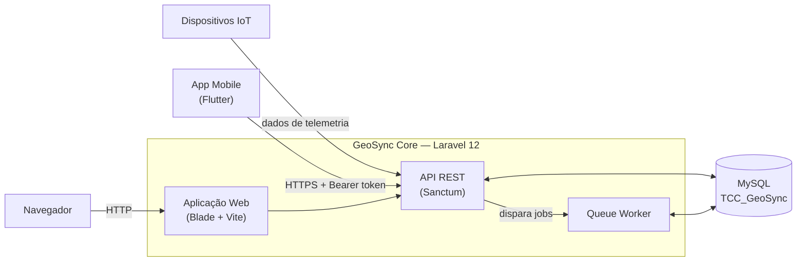
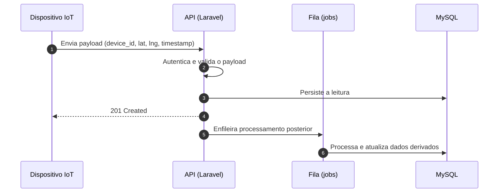
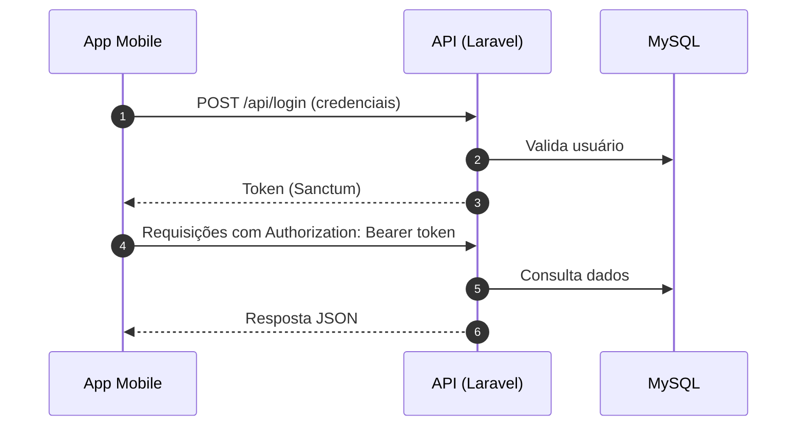

<div align="center">

# GeoSync

**Plataforma integrada de web, IoT e mobile para [TODO: domínio — ex.: monitoramento e sincronização de dados geoespaciais em tempo real].**

[](https://www.php.net/)
[](https://laravel.com/)
[](https://www.mysql.com/)
[](https://vitejs.dev/)
[](https://github.com/mariaclaraluz0/geo_sync_mobile)


</div>

---

## Sumário

1. [Visão geral](#visão-geral)
2. [Principais recursos](#principais-recursos)
3. [Arquitetura](#arquitetura)
4. [Stack tecnológica](#stack-tecnológica)
5. [Estrutura do repositório](#estrutura-do-repositório)
6. [Primeiros passos](#primeiros-passos)
7. [API](#api)
8. [Módulo IoT](#módulo-iot)
9. [Aplicativo mobile](#aplicativo-mobile)
10. [Testes e qualidade de código](#testes-e-qualidade-de-código)
11. [Segurança](#segurança)
12. [Solução de problemas](#solução-de-problemas)
13. [Roadmap](#roadmap)
14. [Contribuindo](#contribuindo)
15. [Equipe](#equipe)
16. [Licença](#licença)

---

## Visão geral

O **GeoSync** é um ecossistema composto por três componentes integrados:

| Componente | Responsabilidade | Localização |
| --- | --- | --- |
| **Backend / Web** | Regras de negócio, autenticação, persistência e API | Este repositório |
| **IoT** | Coleta de dados em campo e envio à plataforma | [`/iot`](./iot) |
| **Mobile** | Consumo dos dados e interação do usuário | [geo_sync_mobile](https://github.com/mariaclaraluz0/geo_sync_mobile) |

> **[TODO]** Descreva em 3 a 5 linhas: qual problema o GeoSync resolve, para quem e qual o diferencial da solução.

Projeto desenvolvido como **Trabalho de Conclusão de Curso (TCC)** — **[TODO: curso e instituição]**.

---

## Principais recursos

- **Autenticação por token** via API (Laravel Sanctum)
- **Login social** (Laravel Socialite) — **[TODO: provedores]**
- **Ingestão de dados IoT** — **[TODO: breve descrição]**
- **[TODO: recurso geoespacial principal]**
- **Integração com aplicativo mobile** (Flutter)
- **Processamento assíncrono** com filas
- **Testes automatizados** (PHPUnit)

<!-- Mantenha apenas recursos que já estão implementados. -->

---

## Arquitetura

### 1. Visão de contexto

Quem interage com o sistema e por quais canais.



> **[TODO]** Ajuste ao fluxo real: protocolo do IoT (HTTP/MQTT), uso de WebSocket/broadcast e serviços externos, se houver.

### 2. Componentes

| Componente | Tecnologia | Responsabilidade | Comunicação |
| --- | --- | --- | --- |
| **Dispositivos IoT** | **[TODO]** | Coletar e enviar dados em campo | Envia para a API |
| **App Mobile** | Flutter / Dart | Interface do usuário final | HTTPS + Bearer token |
| **Aplicação Web** | Blade, Vite | Interface web e painel | HTTP |
| **API REST** | Laravel 12, Sanctum | Autenticação, validação, regras de negócio | JSON sobre HTTP(S) |
| **Queue Worker** | Laravel Queue (`database`) | Processamento assíncrono | Lê e escreve no banco |
| **Banco de dados** | MySQL 8 | Persistência, filas, cache e sessões | Acesso exclusivo do backend |

### 3. Fluxos principais

**Ingestão de dados IoT**



**Autenticação e consumo pelo app mobile**



> **[TODO]** Confirme se os fluxos acima refletem a implementação (resposta do `POST` de ingestão, uso de fila, etc.).

### 4. Organização interna do backend

| Camada | Local | Papel |
| --- | --- | --- |
| **Rotas** | `routes/api.php`, `routes/web.php` | Mapeiam requisições para controllers |
| **Controllers** | `app/Http/Controllers` | Recebem a requisição e delegam |
| **Regras de negócio** | `app/Services` | Lógica da aplicação |
| **Models** | `app/Models` | Acesso a dados via Eloquent |
| **Jobs** | `app/Jobs` | Tarefas assíncronas |
| **Migrations** | `database/migrations` | Versionamento do schema |

> **[TODO]** Confira os diretórios acima com a estrutura real de `app/`.

### 5. Decisões de projeto

| Decisão | Justificativa |
| --- | --- |
| **Laravel 12** | Produtividade, ecossistema maduro, Eloquent e migrations versionadas |
| **Sanctum** | Autenticação por token leve, adequada a SPA, mobile e dispositivos |
| **MySQL** | Banco relacional consolidado; dump (`geosync.sql`) incluso para reproduzir o ambiente |
| **Filas, cache e sessão em `database`** | Reduz dependências de infraestrutura em desenvolvimento (Redis não é obrigatório) |
| **Mobile em repositório separado** | Ciclo de desenvolvimento e versionamento independentes do backend |

---

## Stack tecnológica

| Camada | Tecnologias |
| --- | --- |
| **Linguagem / Framework** | PHP ^8.2 · Laravel ^12.0 |
| **Autenticação** | Laravel Sanctum ^4.0 · Laravel Socialite ^5.28 |
| **Banco de dados** | MySQL |
| **Frontend / Build** | Vite · Node.js · npm |
| **Qualidade** | PHPUnit ^11.5 · Laravel Pint · Laravel Pail |
| **Ambiente** | Laravel Sail (opcional) |
| **IoT** | **[TODO: placa/microcontrolador, sensores, protocolo]** |
| **Mobile** | Flutter · Dart |

---

## Estrutura do repositório

```text
GeoSync/
├── app/                 # Controllers, Models, Services e regras de negócio
├── bootstrap/           # Bootstrap do framework e cache
├── config/              # Configurações da aplicação
├── database/            # Migrations, factories e seeders
├── iot/                 # Firmware e scripts dos dispositivos IoT
├── public/              # Document root e assets compilados
├── resources/           # Views, CSS e JS (fonte do frontend)
├── routes/              # Rotas web e api
├── storage/             # Logs, cache e uploads
├── tests/               # Testes automatizados
├── .env.example         # Modelo de variáveis de ambiente
├── composer.json        # Dependências PHP e scripts
├── package.json         # Dependências JS
├── vite.config.js       # Configuração do Vite
├── geosync.sql          # Dump do banco para setup rápido
└── schema_check.php     # Utilitário de verificação do schema
```

---

## Primeiros passos

### Pré-requisitos

| Ferramenta | Versão mínima |
| --- | --- |
| PHP | 8.2 |
| Composer | 2.x |
| Node.js | 18+ |
| npm | 9+ |
| MySQL | 8.0 (ou MariaDB equivalente) |
| Git | 2.x |

### Instalação

```bash
# 1. Clonar o repositório
git clone https://github.com/MuriloBreda/GeoSync.git
cd GeoSync

# 2. Instalar dependências PHP
composer install

# 3. Criar o .env e gerar a chave da aplicação
cp .env.example .env
php artisan key:generate

# 4. Instalar dependências JavaScript
npm install
```

<details>
<summary><strong>Atalho: setup automatizado</strong></summary>

O script Composer instala dependências, cria o `.env`, gera a chave, executa as migrations e compila os assets:

```bash
composer setup
```

> **Atenção:** configure e crie o banco de dados **antes** de executar este comando, pois ele roda `php artisan migrate --force`.

</details>

### Configuração do banco de dados

**1. Criar o banco**

```sql
CREATE DATABASE TCC_GeoSync CHARACTER SET utf8mb4 COLLATE utf8mb4_unicode_ci;
```

**2. Configurar o `.env`**

```env
DB_CONNECTION=mysql
DB_HOST=127.0.0.1
DB_PORT=3306
DB_DATABASE=TCC_GeoSync
DB_USERNAME=root
DB_PASSWORD=sua_senha
```

**3. Popular o banco** (escolha uma opção)

| Opção | Comando | Quando usar |
| --- | --- | --- |
| **Migrations** | `php artisan migrate` | Ambiente de desenvolvimento padrão |
| **Dump SQL** | `mysql -u root -p TCC_GeoSync < geosync.sql` | Reproduzir o estado do banco do projeto |

**4. (Opcional) Validar o schema**

```bash
php schema_check.php
```

### Variáveis de ambiente

| Variável | Descrição | Padrão |
| --- | --- | --- |
| `APP_ENV` | Ambiente (`local`, `production`) | `local` |
| `APP_DEBUG` | Erros detalhados — **desative em produção** | `true` |
| `APP_URL` | URL base da aplicação | `http://localhost` |
| `DB_CONNECTION` / `DB_HOST` / `DB_PORT` | Conexão com o banco | `mysql` / `127.0.0.1` / `3306` |
| `DB_DATABASE` | Nome do banco | `TCC_GeoSync` |
| `DB_USERNAME` / `DB_PASSWORD` | Credenciais do banco | `root` / *(vazio)* |
| `SESSION_DRIVER` | Driver de sessão | `database` |
| `QUEUE_CONNECTION` | Driver de filas | `database` |
| `CACHE_STORE` | Driver de cache | `database` |
| `MAIL_MAILER` | Driver de e-mail | `log` |
| **[TODO]** `*_CLIENT_ID` / `*_CLIENT_SECRET` / `*_REDIRECT_URI` | Credenciais OAuth (Socialite) | — |

### Executando

**Desenvolvimento (recomendado)** — sobe todos os serviços em paralelo:

```bash
composer dev
```

| Serviço | Comando | Finalidade |
| --- | --- | --- |
| `server` | `php artisan serve` | Servidor HTTP em `http://localhost:8000` |
| `queue` | `php artisan queue:listen` | Processamento de jobs |
| `logs` | `php artisan pail` | Logs em tempo real |
| `vite` | `npm run dev` | Hot reload dos assets |

**Manual**

```bash
php artisan serve   # terminal 1
npm run dev         # terminal 2
```

**Build de produção**

```bash
npm run build
```

---

## API

A API usa **autenticação por token (Bearer)** via Laravel Sanctum.

```http
Authorization: Bearer <seu_token>
Accept: application/json
```

### Endpoints

> **[TODO]** Preencha com os endpoints reais (`php artisan route:list --path=api`).

| Método | Endpoint | Descrição | Auth |
| --- | --- | --- | :---: |
| `POST` | `/api/login` | Autentica o usuário e retorna o token | Não |
| `POST` | `/api/logout` | Revoga o token atual | Sim |
| `GET` | `/api/...` | **[TODO]** | Sim |
| `POST` | `/api/...` | **[TODO]** | Sim |

### Exemplo de requisição

```bash
curl -X POST http://localhost:8000/api/login \
  -H "Accept: application/json" \
  -H "Content-Type: application/json" \
  -d '{"email": "usuario@exemplo.com", "password": "senha"}'
```

---

## Módulo IoT

Código-fonte em [`/iot`](./iot).

| Item | Detalhes |
| --- | --- |
| **Hardware** | **[TODO: microcontrolador, sensores, módulo GPS, etc.]** |
| **Linguagem / Framework** | **[TODO: C++/Arduino, MicroPython, etc.]** |
| **Protocolo de comunicação** | **[TODO: HTTP, MQTT, etc.]** |
| **Frequência de envio** | **[TODO]** |
| **Autenticação** | **[TODO: token de dispositivo, chave de API, etc.]** |

### Gravação do firmware

**[TODO]** Passo a passo (IDE, bibliotecas, configuração de rede e URL da API).

### Formato do payload

```json
{
  "device_id": "geo-001",
  "latitude": -23.5505,
  "longitude": -46.6333,
  "timestamp": "2026-01-01T12:00:00Z"
}
```

> **[TODO]** Substitua pelo payload real enviado pelo dispositivo.

---

## Aplicativo mobile

O cliente mobile é desenvolvido em **Flutter** e mantido em repositório separado: **[mariaclaraluz0/geo_sync_mobile](https://github.com/mariaclaraluz0/geo_sync_mobile)**.

Para conectar o app a esta API:

1. Inicie o backend (`composer dev`).
2. Configure a **URL base da API** no app. **[TODO: indicar arquivo/variável]**
3. No emulador Android, use `http://10.0.2.2:8000` no lugar de `localhost`.

---

## Testes e qualidade de código

```bash
# Executar a suíte de testes
composer test

# Verificar e corrigir o estilo de código (Laravel Pint)
./vendor/bin/pint

# Apenas verificar, sem alterar arquivos
./vendor/bin/pint --test
```

---

## Segurança

- Nunca versione o `.env` ou credenciais (tokens, chaves OAuth, senhas de banco).
- Em produção, defina `APP_ENV=production` e `APP_DEBUG=false`.
- Use HTTPS em todos os ambientes expostos.
- Gere uma `APP_KEY` única por ambiente (`php artisan key:generate`).
- Revise o `geosync.sql` antes de publicar: ele não deve conter dados pessoais reais nem senhas.

Encontrou uma vulnerabilidade? Não abra uma issue pública; entre em contato diretamente com os mantenedores (**[TODO: e-mail]**).

---

## Solução de problemas

<details>
<summary><strong><code>SQLSTATE[HY000] [1049] Unknown database</code></strong></summary>

O banco ainda não foi criado. Execute o `CREATE DATABASE TCC_GeoSync ...` da seção [Configuração do banco de dados](#configuração-do-banco-de-dados).

</details>

<details>
<summary><strong><code>No application encryption key has been specified</code></strong></summary>

Execute `php artisan key:generate`.

</details>

<details>
<summary><strong>Assets não carregam / erro do Vite</strong></summary>

Execute `npm install` e mantenha `npm run dev` ativo (ou use `npm run build`).

</details>

<details>
<summary><strong>Jobs não são processados</strong></summary>

Com `QUEUE_CONNECTION=database`, mantenha um worker ativo: `php artisan queue:listen`.

</details>

<details>
<summary><strong>Mudanças no <code>.env</code> não surtem efeito</strong></summary>

Limpe o cache de configuração: `php artisan config:clear`.

</details>

---

## Roadmap

- [x] Estrutura base com Laravel 12
- [x] Modelagem do banco de dados
- [x] Módulo IoT
- [x] Aplicativo mobile
- [ ] **[TODO]** Próxima funcionalidade
- [ ] **[TODO]** Pipeline de CI (GitHub Actions)
- [ ] **[TODO]** Documentação da API (OpenAPI/Swagger)
- [ ] **[TODO]** Deploy em produção

---

## Contribuindo

Contribuições são bem-vindas.

1. Faça um **fork** do projeto.
2. Crie uma branch: `git checkout -b feat/minha-feature`
3. Use [Conventional Commits](https://www.conventionalcommits.org/pt-br/):
   ```text
   feat: adiciona endpoint de sincronização
   fix: corrige validação de coordenadas
   docs: atualiza README
   ```
4. Garanta que `composer test` e `./vendor/bin/pint --test` passam.
5. Abra um **Pull Request** descrevendo as mudanças.

---

## Equipe

| Nome | Papel | GitHub |
| --- | --- | --- |
| **Murilo Breda** | **[TODO: ex. Backend & IoT]** | [@MuriloBreda](https://github.com/MuriloBreda) |
| **Maria Clara Luz** | **[TODO: ex. Mobile]** | [@mariaclaraluz0](https://github.com/mariaclaraluz0) |

**Orientador(a):** **[TODO]**
**Instituição:** **[TODO]**

---

## Licença

O framework [Laravel](https://laravel.com) é licenciado sob a [MIT License](https://opensource.org/licenses/MIT).

**[TODO]** Defina a licença do GeoSync e adicione o arquivo `LICENSE` na raiz do repositório.

---

<div align="center">

Desenvolvido como Trabalho de Conclusão de Curso · **GeoSync** © 2026

</div>
